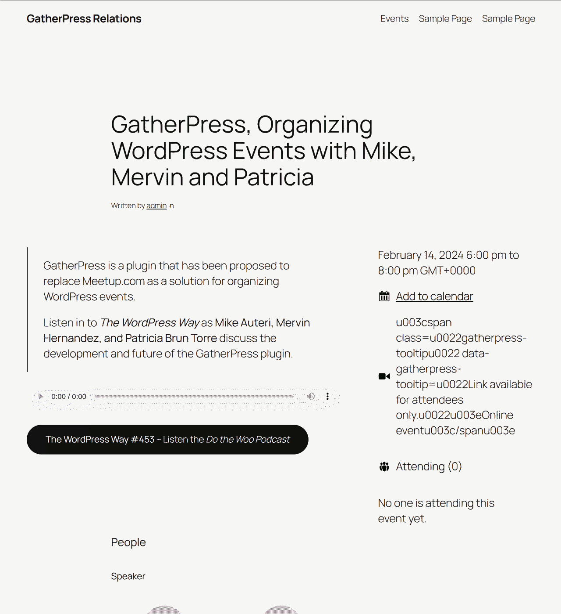

# GatherPress Relations

**Contributors:** carstenbach
**Tags:** block, person, relations, event
**Tested up to:** 6.8
**Stable tag:** 0.1.0
**License:** GPLv2 or later
**License URI:** <https://www.gnu.org/licenses/gpl-2.0.html>

[](https://playground.wordpress.net/?blueprint-url=https://raw.githubusercontent.com/carstingaxion/gatherpress-relations/main/.wordpress-org/blueprints/blueprint.json) [](https://github.com/carstingaxion/gatherpress-relations/actions/workflows/build-test-measure.yml)

Connects persons to events, productions, or any post type — with individual roles per relation. Built on GatherPress shadow taxonomies and WordPress `post_type_supports`.



## Description

GatherPress Relations registers a `gatherpress_person` post type and a relationship system that lets you assign people to any supporting post type with a specific role. A person can be a *Speaker* at one meetup, a *Host* at another, and a *Moderator* at a third — each connection carries its own role and department.

The plugin ships two blocks and a sidebar panel:

- **Cast & Crew List** — renders a grouped roster of people connected to the current post, with headshots, names, roles, and links to person pages. Three style variations: simple list (default), compact table, and cards.
- **Person Recent Roles** — displays a person's recent roles across all connected posts, with linked titles, department badges, and dates. Place it on a person template to show their full history.
- **Manage Cast & Crew sidebar** — available on every supporting post type, even when no block is inserted. Search for people, assign roles and departments, reorder entries.

### Example: WordPress meetup group

A meetup group uses GatherPress for events. With this plugin:

1. Create person posts for your regular contributors.
2. On each event, open the **Cast & Crew** sidebar panel and assign people with roles like *Speaker*, *Moderation*, or *Host*.
3. The Cast & Crew List block on the event page shows who's involved and in what capacity.
4. On a person's page, the Recent Roles block lists every event they've participated in, with their role at each.

The default departments reflect this use case: **Speaker**, **Moderation**, and **Host**. Departments are filterable — theater groups, conferences, or any other domain can customise them via the `gatherpress_relations_departments` filter.

## How it works

- **People are post types**, not taxonomy terms or users. They get the full block editor, featured images, REST API endpoints, and single-page templates.
- **Shadow taxonomies** (from GatherPress core's `gatherpress-shadow-source` support) create the many-to-many relationship between people and consumer posts. Each published person automatically gets a hidden taxonomy term that consumer posts tag themselves with.
- **Roles are junction metadata** stored as `_gatherpress_relations` post meta on the consumer post — a JSON array of `{ slug, id, type, role, department, order }` entries. Roles are contextual to each relationship, not global categories.
- **All wiring is driven by `post_type_supports`**. No post type slug is hard-coded in the relationship layer. Two support strings control the system:
  - `gatherpress-relations-from` — declares a **consumer** post type (the one that carries relation entries and tags itself with shadow terms).
  - `gatherpress-relations-to` — declares a **connectable source** post type (the one whose shadow taxonomy gets wired onto consumers).

```php
// Make "my_event" a consumer that can receive person/sponsor connections:
add_post_type_support( 'my_event', 'gatherpress-relations-from' );

// Make "my_sponsor" a connectable source (requires gatherpress-shadow-source too):
add_post_type_support( 'my_sponsor', 'gatherpress-relations-to' );
```

The plugin discovers all supporting types at `init:100` via `get_post_types_by_support()` and wires everything automatically.

## Requirements

- WordPress 6.4+
- PHP 8.0+
- [GatherPress](https://wordpress.org/plugins/gatherpress/) (declared as a required plugin)

Optional: [gatherpress-productions](https://github.com/carstingaxion/gatherpress-productions) for the `gatherpress_play` post type.

## Installation

1. Install and activate [GatherPress](https://wordpress.org/plugins/gatherpress/).
2. Upload `gatherpress-relations` to `/wp-content/plugins/` or install via the WordPress plugin screen.
3. Activate.

The `gatherpress_person` post type and both blocks are immediately available. GatherPress events (`gatherpress_event`) are automatically bridged into the relations system.

## Customising departments

The default departments are:

| Slug | Label |
|------|-------|
| `speaker` | Speaker |
| `moderation` | Moderation |
| `host` | Host |

Override them per source type:

```php
add_filter( 'gatherpress_relations_departments', function ( array $departments, string $source_type ): array {
    if ( 'gatherpress_person' === $source_type ) {
        return [
            'cast'             => __( 'Cast', 'textdomain' ),
            'direction'        => __( 'Direction', 'textdomain' ),
            'design'           => __( 'Design', 'textdomain' ),
            'stage_management' => __( 'Stage Management', 'textdomain' ),
            'musicians'        => __( 'Musicians', 'textdomain' ),
            'production'       => __( 'Production', 'textdomain' ),
            'other'            => __( 'Other', 'textdomain' ),
        ];
    }
    return $departments;
}, 10, 2 );
```

The second parameter is the **source post type slug** (e.g., `gatherpress_person`, `gatherpress_sponsor`), not the consumer. This means departments follow the connectable type — sponsors always get their tiers, people always get their roles, regardless of which consumer post type they're assigned to. Both the editor sidebar and the frontend rendering use this filter.

## Screenshots

1. 
2. 
3. 

## Developer documentation

Architecture details, class structure, hook execution order, meta schema, and editor hook API are documented in [`docs/developer/README.md`](docs/developer/README.md).

## Changelog

All notable changes to this project will be documented in the [CHANGELOG.md](CHANGELOG.md).

## License

GPLv2 or later. See [LICENSE](https://www.gnu.org/licenses/gpl-2.0.html).
